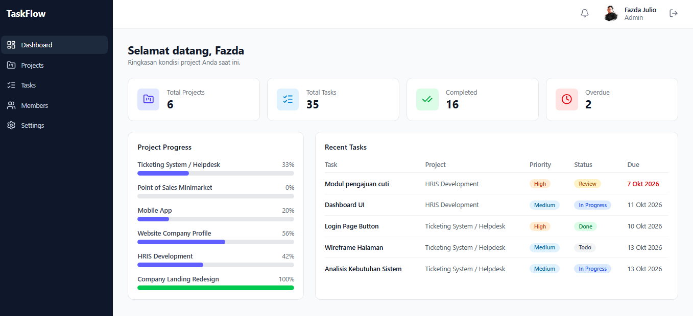
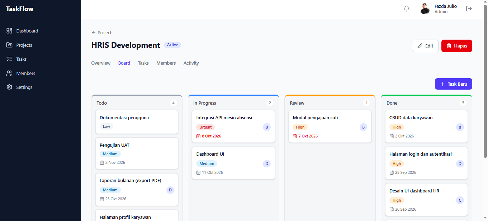
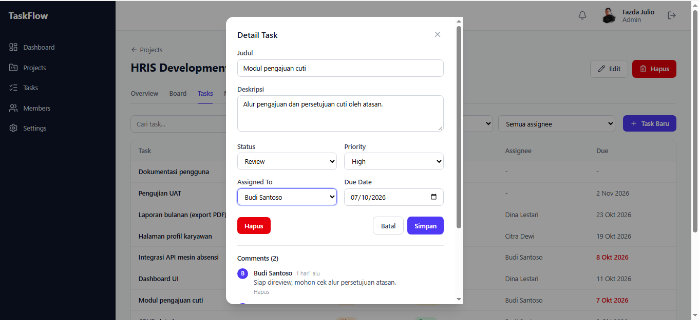
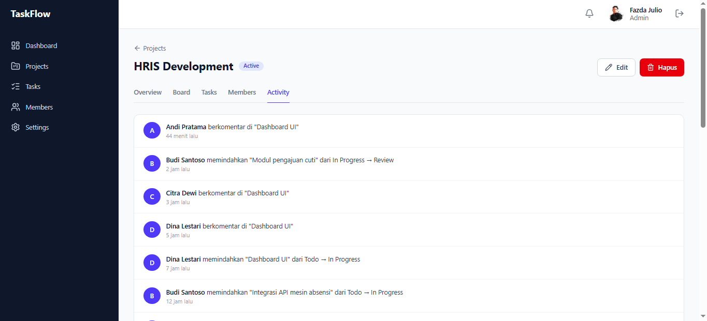
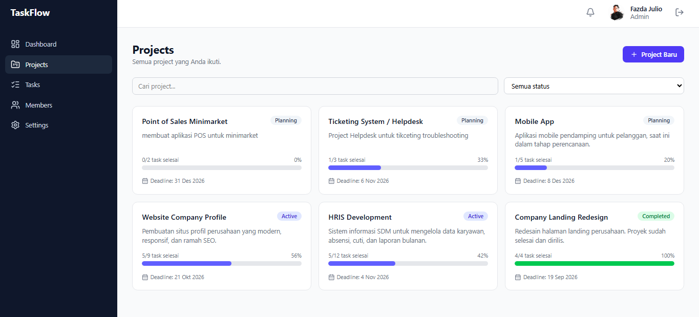
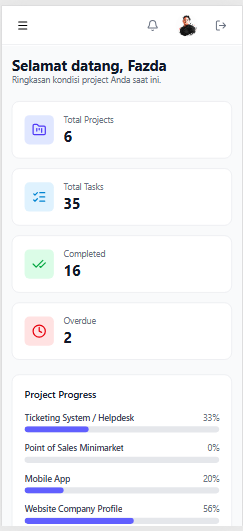
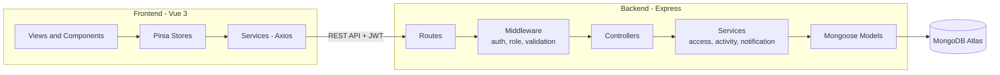

<div align="center">

# TaskFlow

**Aplikasi manajemen proyek dengan Kanban Board, kolaborasi tim, dan pelacakan aktivitas.**

Bagi project menjadi task, tentukan siapa mengerjakan apa, dan pantau progress dalam satu tampilan.


</div>

---

## Tentang Proyek

TaskFlow dibuat untuk tim kecil yang butuh sistem pengelolaan pekerjaan yang sederhana, tanpa kompleksitas seperti Jira. Pengguna dapat membuat project, membagi pekerjaan menjadi task, mengundang anggota, memindahkan task di Kanban Board, berdiskusi lewat komentar, dan melihat riwayat aktivitas project.

Proyek ini dibangun full-stack sebagai portfolio, dengan fokus pada hal yang sering diabaikan di aplikasi demo: **otorisasi yang benar di sisi server**, state management yang rapi, dan pengalaman pengguna yang responsif.

## Fitur Utama

**Manajemen pekerjaan**

- **Kanban Board** dengan drag and drop (Todo, In Progress, Review, Done) dan optimistic update
- **Project dan Task CRUD** lengkap dengan prioritas, deadline, status, dan assignee
- **Progress project** dihitung otomatis dari jumlah task yang selesai
- **Search dan filter** project dan task secara instan tanpa reload halaman

**Kolaborasi tim**

- **Manajemen anggota** project beserta jabatan masing-masing
- **Komentar** pada task (tambah, edit, hapus milik sendiri)
- **Activity log** yang dicatat otomatis oleh server: siapa memindahkan task apa, kapan
- **Notifikasi** saat ditugaskan pada task dan saat deadline mendekat

**Dashboard dan akun**

- **Dashboard** berisi statistik, progress per project, dan task terbaru, dengan cakupan data yang menyesuaikan peran pengguna
- **Autentikasi JWT**, profil, ganti password, dan upload avatar
- **Tiga peran** (Admin, Manager, Member) dengan hak akses berbeda, dan admin dapat mengatur peran pengguna lain

## Screenshot

| Dashboard                                    | Kanban Board                           |
| -------------------------------------------- | -------------------------------------- |
|  |  |

| Detail Task dan Komentar                  | Activity Log                               |
| ----------------------------------------- | ------------------------------------------ |
|  |  |

| Daftar Project                             | Tampilan Mobile                        |
| ------------------------------------------ | -------------------------------------- |
|  |  |

## Tech Stack

| Lapisan    | Teknologi                                                                              |
| ---------- | -------------------------------------------------------------------------------------- |
| Frontend   | Vue 3 (Composition API), Vite, Vue Router, Pinia, Axios, Tailwind CSS v4, vuedraggable |
| Backend    | Node.js, Express, Mongoose, JWT, bcrypt, express-validator, helmet, express-rate-limit |
| Database   | MongoDB Atlas                                                                          |
| Deployment | Vercel (frontend dan backend serverless)                                               |

## Arsitektur



Alur sebuah request: **Route, Middleware, Controller, Service, Model, MongoDB**. Validasi input dan pengecekan hak akses terjadi sebelum logika bisnis dijalankan.

## Peran dan Hak Akses

| Aksi                               | Admin |             Manager              |       Member        |
| ---------------------------------- | :---: | :------------------------------: | :-----------------: |
| Membuat project                    |  Ya   |                Ya                |          -          |
| Mengubah project                   | Semua | Project miliknya / yang ia ikuti |          -          |
| Menghapus project                  |  Ya   |                -                 |          -          |
| Menambah atau mengeluarkan anggota |  Ya   |    Ya (project yang diikuti)     |          -          |
| Membuat, mengubah, menghapus task  |  Ya   |    Ya (project yang diikuti)     |          -          |
| Mengubah status dan deskripsi task | Semua |       Semua di project-nya       | Hanya task miliknya |
| Berkomentar                        |  Ya   |                Ya                |         Ya          |
| Menghapus komentar                 | Semua |             Miliknya             |      Miliknya       |
| Mengatur peran pengguna            |  Ya   |                -                 |          -          |

Semua aturan di atas ditegakkan di **backend**. Frontend hanya mencerminkannya agar tampilan tidak menawarkan aksi yang pasti ditolak.

## Keputusan Teknis yang Menarik

- **Otorisasi di server, bukan di UI.** Setiap endpoint memeriksa apakah pengguna memang anggota project terkait. Menebak URL atau memanggil API langsung lewat Postman tetap ditolak dengan 403.
- **Optimistic update pada Kanban.** Kartu langsung berpindah saat di-drop; jika request gagal, posisinya dikembalikan dan pengguna diberi tahu.
- **Activity log dicatat oleh backend**, sehingga tidak bisa dipalsukan dari client. Kegagalan mencatat log tidak menggagalkan aksi utamanya.
- **Notifikasi deadline tanpa cron.** Notifikasi dibuat secara lazy saat pengguna membuka notifikasi, dengan unique index untuk mencegah duplikat di hari yang sama. Cocok untuk lingkungan serverless.
- **Avatar tanpa penyimpanan file.** Gambar dipotong dan dikecilkan di browser dengan Canvas, lalu disimpan sebagai data URL. Tidak butuh object storage untuk fitur dasar.
- **Backend siap serverless.** Koneksi MongoDB di-cache antar request, dan server lokal serta fungsi serverless memakai aplikasi Express yang sama.
- **Filter sebagai composable.** `useTaskFilters` dipakai ulang di halaman task project dan halaman Tasks global.
- **Dashboard sadar peran.** Admin dan manager melihat gambaran seluruh project; member melihat tugasnya sendiri.

## Struktur Folder

```
taskflow/
├── backend/
│   ├── api/                 # entry point serverless
│   ├── scripts/seed.js      # data demo
│   ├── src/
│   │   ├── config/          # koneksi database
│   │   ├── controllers/
│   │   ├── middleware/      # auth, validasi, error handler
│   │   ├── models/
│   │   ├── routes/
│   │   ├── services/        # akses project, activity, notifikasi
│   │   ├── utils/
│   │   └── app.js
│   └── server.js            # entry point lokal
│
└── frontend/
    └── src/
        ├── components/      # ui, layout, project, task, dashboard
        ├── composables/
        ├── layouts/
        ├── router/          # route guard
        ├── services/        # Axios + pemanggil API
        ├── stores/          # Pinia
        ├── utils/
        └── views/
```

## Ringkasan API

Semua endpoint selain register dan login membutuhkan header `Authorization: Bearer <token>`.

| Area          | Endpoint                                                                                                                                     |
| ------------- | -------------------------------------------------------------------------------------------------------------------------------------------- |
| Auth          | `POST /api/auth/register` `POST /api/auth/login` `POST /api/auth/logout` `GET /api/auth/me` `PUT /api/auth/profile` `PUT /api/auth/password` |
| Users         | `GET /api/users` `PATCH /api/users/:id/role`                                                                                                 |
| Projects      | `GET/POST /api/projects` `GET/PUT/DELETE /api/projects/:id`                                                                                  |
| Members       | `POST /api/projects/:id/members` `DELETE /api/projects/:id/members/:userId`                                                                  |
| Activity      | `GET /api/projects/:id/activities`                                                                                                           |
| Tasks         | `GET /api/tasks` `GET/POST /api/projects/:projectId/tasks` `GET/PUT/DELETE /api/tasks/:id` `PATCH /api/tasks/:id/status`                     |
| Comments      | `GET/POST /api/tasks/:taskId/comments` `PUT/DELETE /api/comments/:id`                                                                        |
| Notifications | `GET /api/notifications` `PATCH /api/notifications/:id/read` `PATCH /api/notifications/read-all`                                             |
| Dashboard     | `GET /api/dashboard`                                                                                                                         |

## Menjalankan di Lokal

**Prasyarat:** Node.js 20 atau lebih baru, dan sebuah database MongoDB (disarankan MongoDB Atlas, tersedia paket gratis).

```bash
git clone https://github.com/<username>/taskflow.git
cd taskflow
```

**1. Backend**

```bash
cd backend
npm install
cp .env.example .env     # lalu isi nilainya
npm run dev              # berjalan di http://localhost:5000
```

Isi `backend/.env`:

```env
NODE_ENV=development
PORT=5000
MONGODB_URI=mongodb+srv://<user>:<password>@<cluster>.mongodb.net/taskflow
JWT_SECRET=ganti_dengan_string_acak_panjang
JWT_EXPIRES_IN=7d
CLIENT_URL=http://localhost:5173
```

**2. Frontend**

```bash
cd frontend
npm install
cp .env.example .env
npm run dev              # berjalan di http://localhost:5173
```

Isi `frontend/.env`:

```env
VITE_API_URL=http://localhost:5000/api
```

## Data Demo

Agar aplikasi langsung terisi, jalankan script seed dari folder `backend`:

```bash
npm run seed          # buat data demo (meminta konfirmasi)
npm run seed:clean    # hapus data demo
```

Script membuat 5 pengguna, 4 project, 30 task dengan berbagai status dan deadline (termasuk yang terlambat), komentar, activity log, dan notifikasi. Semua data demo ditandai dengan email `@example.com`, dan script **hanya menyentuh data tersebut**.

| Nama         | Role    | Email             | Password    |
| ------------ | ------- | ----------------- | ----------- |
| Andi Pratama | Manager | andi@example.com  | `Demo12345` |
| Rina Kartika | Manager | rina@example.com  | `Demo12345` |
| Budi Santoso | Member  | budi@example.com  | `Demo12345` |
| Citra Dewi   | Member  | citra@example.com | `Demo12345` |
| Dina Lestari | Member  | dina@example.com  | `Demo12345` |

Akun Admin tidak dibuat oleh seed. Daftar lewat halaman Register, lalu ubah field `role` pengguna tersebut menjadi `admin` langsung di database.

## Deployment

Frontend dan backend di-deploy sebagai dua project terpisah di Vercel dari repository yang sama (root directory `frontend` dan `backend`), dengan MongoDB Atlas sebagai database. Backend berjalan sebagai serverless function, dan setiap `git push` ke branch `main` men-deploy ulang secara otomatis.

Variabel environment yang dibutuhkan ada di bagian "Menjalankan di Lokal".

## Tes Otomatis

Backend punya 186 tes integrasi (Vitest + Supertest) yang menguji aturan akses per peran,
alur utama, dan kasus tepi. Tes berjalan di MongoDB in-memory dan tidak menyentuh database aplikasi.

```bash
cd backend
npm test
```

## Roadmap

- [x] **Phase 1:** autentikasi, dashboard, project dan task CRUD, Kanban dengan drag and drop, assign task, profil
- [x] **Phase 2:** komentar, manajemen anggota, activity log, search dan filter, notifikasi
- [x] Dark mode
- [x] Analytics (grafik task per status dan per anggota)
- [x] Tampilan kalender berdasarkan deadline
- [x] Tes otomatis

## Penulis

Dibuat oleh **Fazda Julio Arzika**

[GitHub](https://github.com/fazdajkulioarzika) · [LinkedIn](https://www.linkedin.com/in/fazda-julio-arzika-a35737292/)
